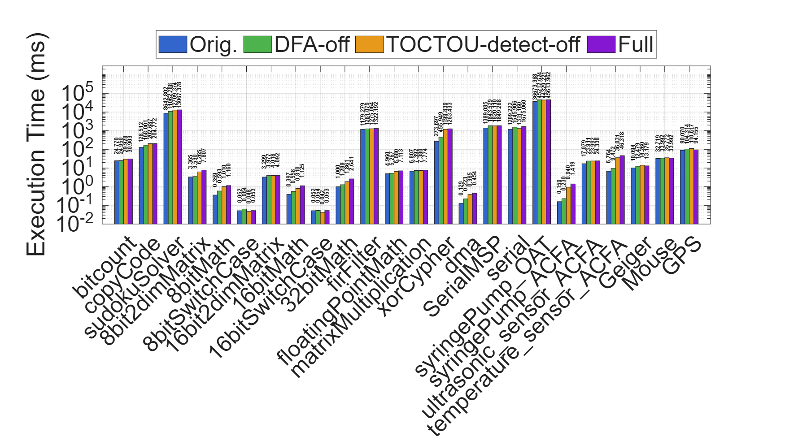
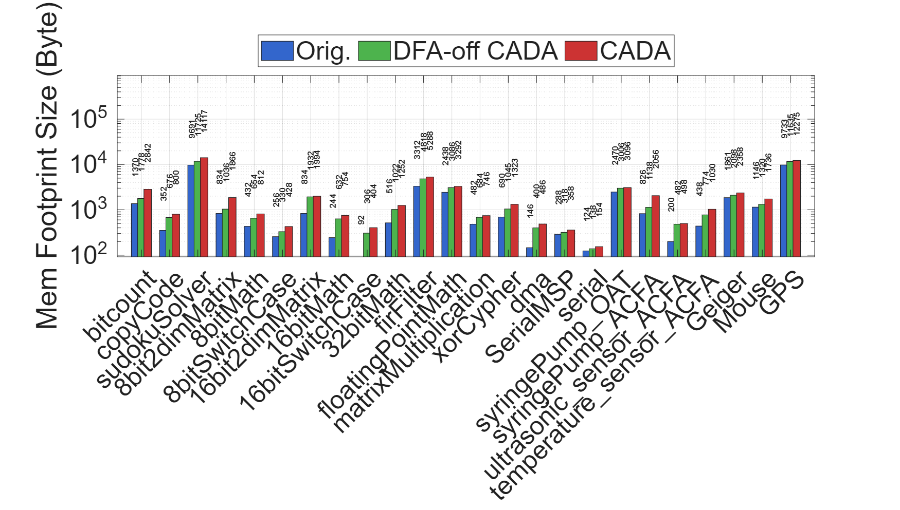
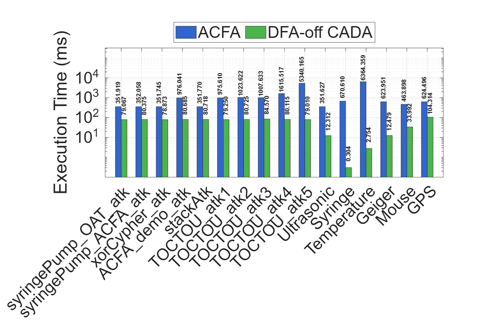
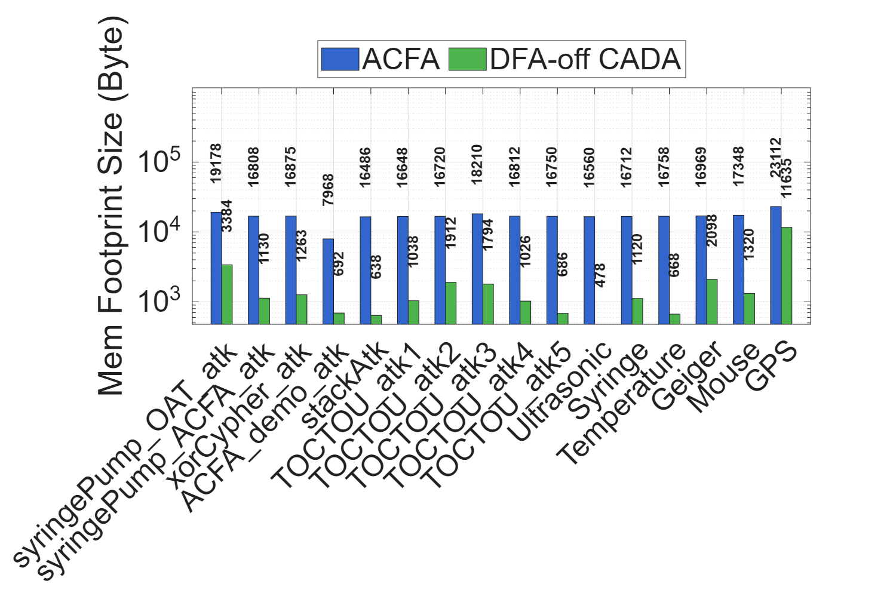

# Evaluation

> This Markdown page contains performance of more apps in RQ1 and RQ2: **Performance Overhead (RQ1)** and **CFA and TOCTOU Detection Performance (RQ2)**. Because zenodo can not compile markdown, for a better experience please download all files from repo and then see this markdown file locally.

We evaluate CADA's execution-time overhead, memory-footprint size, attack-mitigation effectiveness, and overall power consumption. CADA is implemented and evaluated on an MSP430F5529 board featuring a 25 MHz MCU, 8 KB SRAM, and 128 KB Flash: 64 KB for the prover space and 64 KB for the TCM space. The prover space is further divided into 32 KB for application accommodation and 32 KB for receiving application updates. CADA is run at the default MCU-speed setting of 1 MHz.

For fair comparison with the CFA and TOCTOU approaches, we use **DFA-off CADA** because the DFA mechanism has a relatively high cost. We also develop **TOCTOU-off CADA**, which contains only the CFA and DFA components, for ablation studies.

Our best-effort baseline reproduction supports ACFA. We adapt ACFA to a Basys3 board with an Xilinx Artix-7 FPGA, 1.8 MB RAM, and 32 MB Flash. Its internal clock speed exceeds 450 MHz. This hardware is generally more capable than CADA's MSP430F5529 platform, which makes the comparison in RQ2 conservative with respect to CADA. For the remaining baselines, we compare with the results reported in Verify&Revive and DIALED.

The datasets used in the evaluation are listed below. Applications in `S2`, as well as two applications in `S5`, are injected with attacks.

**Dataset for Evaluations**

| Dataset | # Apps | Description |
|---|---:|---|
| `S1` | 24 | Apps compatible with our target platform (MSP430F5529), including both CPU-intensive and I/O-intensive tasks. Seven of the apps are used by other CFA and DFA studies and are real embedded programs. In particular, the app `dma` uses only MSP430's DMA read rather than DMA write, thus not violating CADA's design. |
| `S2` | 10 | Five apps containing control-flow hijacking vulnerabilities, and five apps conducting TOCTOU attacks. |
| `S3` | 6 | Apps from SpecCFA. |
| `S4` | 4 | Applications from SμV, used by the Verify & Revive TOCTOU-mitigation approach. |
| `S5` | 5 | Five applications used for DFA evaluation. Two are injected with data-only attacks; the other three are from Tiny-CFA and are used by DIALED. |

## Performance Overhead (RQ1)

We evaluate runtime overhead on dataset `S1`. We measure the execution time of applications under CADA, DFA-off CADA, and TOCTOU-detect-off CADA, and compare it with execution on the unmodified MCU.

As shown in Figure 3, the average execution-time increase is **24.31%** for DFA-off CADA, **26.98%** for TOCTOU-detect-off CADA, and **30.17%** for full CADA. These results use CADA's address-key-guided evidence collection. When cumulative-hash-based evidence collection is used, DFA-off CADA incurs an average execution-time increase of approximately **166.35%**, motivating the address-key-guided design while retaining support for cumulative hashes when cryptographic collision resistance is required.

*Figure 3. Execution Time Overhead of CADA. A logarithmic scale is used to accommodate the diversity of execution times across programs; absolute values are also marked.*

CADA instruments each runtime memory-read instruction to measure memory-read values for DFA. Consequently, the prover ELF file is larger than the original application ELF file. CADA's compiler toolchain reduces this size by retaining only critical code and data sections. CADA accommodates programs with a deployment-time memory footprint of up to 32 KB, where the memory footprint denotes the flash occupied by the application binary image.

Figure 4 compares CADA binary-image footprints with those of the original binaries. The average memory-footprint increase is **31.61%** for DFA-off CADA and **54.65%** for full CADA. TOCTOU-detect-off CADA has the same memory footprint as full CADA.

*Figure 4. Memory Footprint Overhead of CADA. TOCTOU-detect-off CADA has the same memory footprint as full CADA.*

We further evaluate CADA's symbolic-execution performance. The following table reports path and code coverage on dataset `S1`.

**Symbolic Execution Coverage of CADA**

| Application | KLEE Path (%) | KLEE Code (%) | Angr Path (%) | Angr Code (%) |
|---|---:|---:|---:|---:|
| `bitcount` | 94.6 | 93.0 | 90.5 | 88.0 |
| `copyCode` | 63.9 | 62.3 | 50.0 | 50.1 |
| `sudokuSolver` | 98.8 | 97.2 | 92.9 | 93.1 |
| `8bit2dimMatrix` | 98.2 | 97.1 | 90.0 | 85.4 |
| `8bitMath` | 96.7 | 94.3 | 66.7 | 63.5 |
| `8bitSwitchCase` | 96.6 | 94.1 | 50.0 | 50.5 |
| `16bit2dimMatrix` | 98.2 | 97.3 | 90.0 | 85.2 |
| `16bitMath` | 96.7 | 94.4 | 66.7 | 63.4 |
| `16bitSwitchCase` | 96.7 | 94.2 | 50.0 | 50.6 |
| `32bitMath` | 96.2 | 94.2 | 66.7 | 63.1 |
| `firFilter` | 92.2 | 90.1 | 80.0 | 78.2 |
| `floatingPointMath` | 91.4 | 89.2 | 50.0 | 50.3 |
| `matrixMultiplication` | 100.0 | 100.0 | 100.0 | 100.0 |
| `xorCypher` | 100.0 | 100.0 | 100.0 | 100.0 |
| `dma` | 62.2 | 60.4 | 50.0 | 50.1 |
| `SerialMSP` | 61.7 | 100.0 | 50.0 | 100.0 |
| `serial` | 60.7 | 100.0 | 50.0 | 100.0 |
| `syringePump_OAT` | 100.0 | 100.0 | 92.9 | 93.3 |
| `syringePump_ACFA` | 100.0 | 100.0 | 100.0 | 100.0 |
| `ultrasonic_sensor_ACFA` | 85.6 | 83.4 | 71.4 | 73.2 |
| `temperature_sensor_ACFA` | 87.7 | 85.3 | 77.3 | 78.1 |
| `Geiger` | 100 | 100 | 100 | 100 |
| `Mouse` | 92.9  | 90.1 | 70.7 | 69.2 |
| `GPS` | 74.9 | 70.9 |	77.8 | 67.8 |
| **Average** | **89.4** | **91.1** | **74.3** | **77.2** |

On average, CADA achieves **89.4%** KLEE-based path coverage and **74.3%** Angr-based path coverage. Source-level, KLEE-based symbolic execution generally yields higher path coverage than Angr-based symbolic execution over the MSP430 binary. Porting an MSP430 application to Linux replaces hardware-dependent code with standard C interfaces that KLEE handles effectively. KLEE operates on LLVM IR, preserving source-level type information and control-flow structure, which enables precise constraint generation and more efficient path exploration.

Although Angr can reliably lift MSP430 binary code to Pcode IR, this IR lacks some type and semantic information, and the pattern-based type inference may be less accurate than LLVM IR. Complete symbolic execution in Angr also requires substantial manual modeling of peripherals and interrupts; the current models can still lead to invalid states and missed paths. Eight applications achieve path coverage of at least 90% at different levels. The lowest path coverage occurs in `serial`, `SerialMSP`, and `dma`. The serial applications depend on randomized or irregular UART input, which can cause state-space explosion without reducing code coverage. The lower coverage of `dma` primarily results from incomplete interrupt simulation at both Pcode-IR and LLVM-IR levels. The other 18 applications consistently achieve substantially higher coverage, supporting the practicality of CADA's symbolic execution for typical MSP430 workloads and its use in building offline measurement databases.

## CFA and TOCTOU Detection Performance (RQ2)

### Attack Detection Effectiveness

We compare CADA's control-flow attestation capability with the state-of-the-art CFA approach ACFA [2023Caulfield]. This evaluation uses DFA-off CADA and dataset `S2`, whose applications contain injected control-flow hijacking exploits or TOCTOU attacks.

**Attack Detection Effectiveness Comparison between ACFA and DFA-off CADA**

| Application | ACFA | DFA-off CADA |
|---|---|---|
| `syringePump_OAT_atk` | ✗ | ✓ |
| `syringePump_ACFA_atk` | False positive caused by incomplete offline measurement | ✓ |
| `xorCypher_atk` | ✗ | ✓ |
| `ACFA_demo_atk` | ✓ | ✓ |
| `stackAtk` | ✗ | ✓ |
| `TOCTOU_atk1` | ✗ | ✓ |
| `TOCTOU_atk2` | ✗ | ✓ |
| `TOCTOU_atk3` | False positive: control-flow violation | ✓ |
| `TOCTOU_atk4` | False positive: control-flow violation | ✓ |
| `TOCTOU_atk5` | False positive: control-flow violation | ✓ |

For the five applications under control-flow attacks, ACFA detects only the injected attack in `ACFA_demo_atk`. In that application, a buffer overflow overwrites the target address of `ret` in `waitForPassword` with `0xe06c`; ACFA's verifier reports the invalid edge `(0xe10a, 0xe06c)`, which violates the offline-measured legal edge `(0xe10a, 0xe058)`.

For `syringePump_OAT_atk`, `stackAtk`, and `xorCypher_atk`, ACFA's verifier waits for the prover's response but cannot complete the online procedure. In these cases, the ACFA board displays the address of `__stop_progExec__` to signal prover termination, but the verifier does not capture this termination or report the control-flow attack. In `syringePump_ACFA_atk`, ACFA's offline phase fails to record a legal conditional edge `(0xe174, 0xe1be)` in `syringepump`; it records `(0xe17a, 0xe1be)` instead. ACFA therefore reports a false positive for a legal control-flow event and fails to identify the actual control-flow attack. In contrast, CADA detects the control-flow attacks in all programs with control-flow vulnerabilities.

DFA-off CADA also detects TOCTOU attacks in `S2`. After the benign application is restored and runs again, CADA's verifier launches an *evident-send* challenge. Although the verifier may obtain valid control-flow evidence, the latest memory-write count bound to that evidence is invalid because of the compromised code update. Detection can occur at any control-flow event because offline measurements associate each event with a valid range of write counts. ACFA does not support TOCTOU detection. For `TOCTOU_atk1` and `TOCTOU_atk2`, its CFA process again does not terminate correctly; in the remaining cases, it reports a non-existent control-flow violation within a library function because of inaccurate offline measurements.

### CFA Overhead Comparison

We compare the execution time and memory-footprint size of CADA with ACFA using datasets `S2` and `S3`. For applications terminated by ACFA's prover at `__stop_progExec__`, ACFA execution time is measured up to the final successful reception of a control-flow log by the ACFA verifier.

Figure 5 shows that ACFA executes more slowly than DFA-off CADA because it uses HMAC computation to generate online measurements. CADA instead uses XOR computation, while memory isolation and static code validation simplify runtime boundary checks. ACFA also stores its offline measurement collection in multiple files, increasing verifier-side evidence-search costs. Across `S2` and `S3`, CADA reduces overall execution time by **94.05%** under address-key-guided evidence collection and by **84.01%** under cumulative-hash evidence collection, relative to ACFA.

*Figure 5. Execution Time Comparison between ACFA and DFA-off CADA.*

Figure 6 compares binary memory footprints. ACFA binaries are substantially larger because their TCB must be compiled into a single binary together with the application. CADA separates TCM and application builds, producing a smaller prover binary and allowing more flexible deployment. Each ACFA prover footprint includes roughly 16 KB for the TCB. CADA's TCM is approximately 20 KB, but it is deployed once rather than being configured in the bitstream whenever an application is replaced. Overall, CADA reduces the application memory footprint by **85.67%** relative to ACFA.

*Figure 6. Memory Footprint Size Comparison between ACFA and DFA-off CADA.*

### TOCTOU Detection Overhead Comparison

CADA's TOCTOU detection follows a similar principle to the TOCTOU-secure approach Verify & Revive. Because an implementation of Verify & Revive is unavailable, we use dataset `S4` to compare CADA's memory-footprint overhead with the results reported in Verify&Revivie.

Among the four `S4` applications, `Storage R/W` writes to Flash and is rejected by CADA's toolchain validation. We therefore port the other three applications—`Crypto`, `Crypto ptr`, and `Sense temp`—to the CADA board. The port changes general-purpose I/O registers, pins, and UART communication functions from the original Harvard-architecture programs to MSP430F5529 equivalents while retaining the applications' overall functionality. Because of ISA differences, the original-program footprints differ from those reported in Verify&Revivie.

**Memory Footprint Overhead Comparison between Verify & Revive and CADA**

| Application | Orig.  | SμV+REVIVE  | Orig. | CADA |
|---|---:|---:|---:|---:|
| `Crypto` | 1,414 B | 1,461 B (+3.20%) | 1,486 B | 1,628 B (+9.55%) |
| `Crypto ptr` | 1,438 B | 1,491 B (+3.55%) | 1,792 B | 1,946 B (+8.59%) |
| `Sense temp` | 1,012 B | 1,067 B (+5.15%) | 1,512 B | 1,656 B (+9.52%) |
| **Average overhead** |  | **4.01%** |  | **9.19%** |

CADA's average memory-footprint overhead is **9.19%**, compared with **4.01%** reported for Verify & Revive. The additional CADA overhead results from instrumentation and measurement of control-flow events, which provide defense against control-flow attacks in addition to TOCTOU detection.
